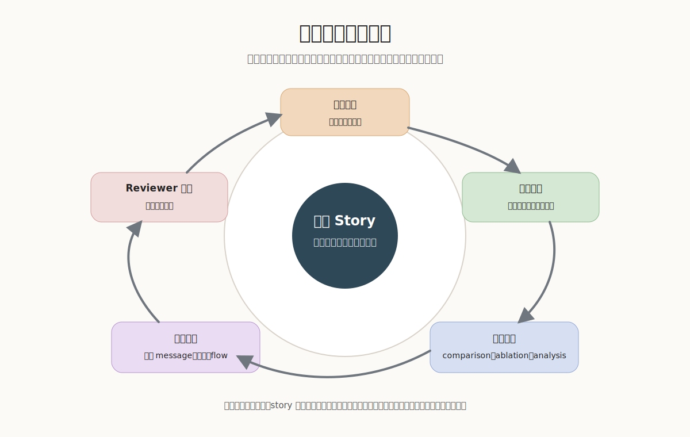
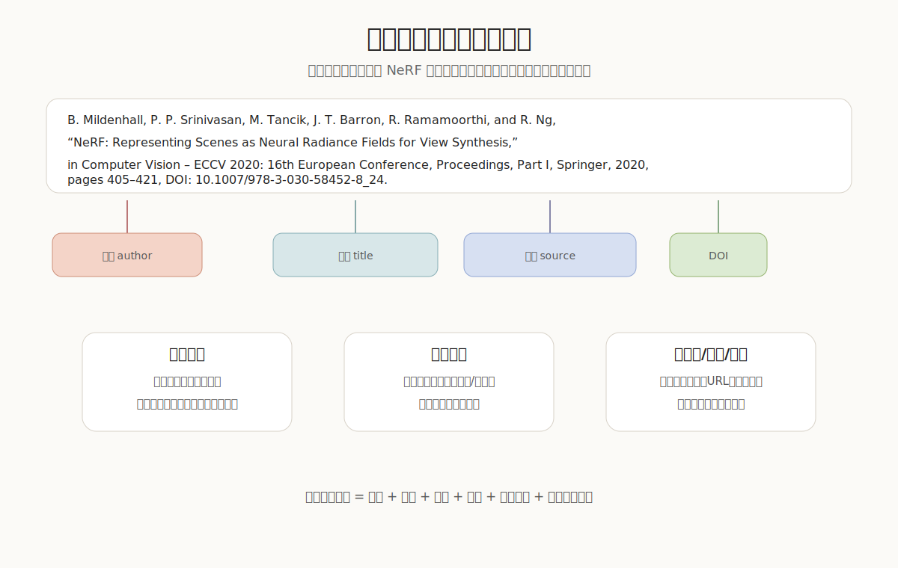

<div align="center">

# 科研论文写作规范

### 实验室新人论文写作与汇报手册

把科研经验沉淀成一份能直接查、直接用、能反复自检的写作规范。


</div>

---

## 目录

| 模块 | 解决什么问题 | 快速跳转 |
|---|---|---|
| **0. 写作总纲** | 写论文前先统一判断标准 | [进入](#0-写作总纲先判断再表达) |
| **1. 从项目到论文** | 项目怎么变成可投稿论文 | [进入](#1-从项目到论文先搭-story-再写正文) |
| **2. 论文正文写法** | Title、Abstract、Introduction、Method、Experiments 怎么写 | [进入](#2-论文正文写法每一节都要回答固定问题) |
| **3. 组会汇报** | 组会怎么报判断，而不是报流水账 | [进入](#3-组会汇报不要只报结果要报判断) |
| **4. 参考文献规范** | 会议、期刊、GB/T 7714、特殊情况怎么写 | [进入](#4-参考文献规范真实完整可追溯) |
| **5. 符号与字母规范** | 向量、矩阵、图像、loss 等符号怎么统一 | [进入](#5-符号与字母规范让公式可读) |
| **6. 投稿前检查** | 截稿前最后如何自查 | [进入](#6-投稿前检查少犯低级错误) |

---



## 0. 写作总纲：先判断，再表达

> [!IMPORTANT]
> 写论文不是把实验结果翻译成英文，而是让读者相信：问题值得研究，方法有必要，证据能支撑结论。

| 原则 | 一句话解释 | 常见错误 |
|---|---|---|
| 先搭 story | 先讲清 Task、Gap、Insight、Method、Evidence | 一上来写 Method，论文没有主线 |
| 每个 claim 都要有证据 | 强结论必须能追到实验、图表、引用或分析 | Abstract 写得很强，实验撑不住 |
| 图表也是论证 | 图、表、caption 要帮助读者理解贡献 | 图表只是装饰，没有结论 |
| 失败结果要解释 | failure case 用来说明边界和下一步 | 只报“失败了”，不说明原因 |
| 格式服务可读性 | 引用、符号、公式统一，减少读者理解成本 | 同一变量前后换符号、换含义 |

---

## 1. 从项目到论文：先搭 story，再写正文

### 1.1 一篇论文的主线

写正文前，先用下面 8 个问题检查项目是否已经能讲成论文。

| 问题 | 你必须能回答 |
|---|---|
| Task 是什么 | 输入、输出、目标是什么 |
| Application 是什么 | 这个任务为什么重要 |
| Existing methods 怎么做 | 现有路线是什么 |
| Gap 在哪里 | 旧方法在哪些条件下失败 |
| Insight 是什么 | 你观察到的关键事实是什么 |
| Method 怎么利用 insight | 方法如何把观察变成设计 |
| Contribution 是什么 | 相比已有工作新增了什么 |
| Evidence 是什么 | 哪些实验支撑上述贡献 |

> [!TIP]
> 判断 story 是否成熟：不用图、不看代码，3 分钟能否讲清“问题为什么重要、旧方法为什么不够、我们为什么有效”。

### 1.2 推荐写作顺序

| 顺序 | 任务 | 目的 |
|---|---|---|
| 1 | 画 pipeline 草图 | 检查方法能否被清楚解释 |
| 2 | 梳理 Introduction 主线 | 确定卖点和实验需求 |
| 3 | 设计 comparison / ablation | 避免写完才发现 claim 没证据 |
| 4 | 写 Method 初稿 | 讲清模块动机、设计和优势 |
| 5 | 写 Experiments | 用证据回答 reviewer 质疑 |
| 6 | 写 Related Work | 定位本文贡献，而不是罗列文献 |
| 7 | 写 Title / Abstract | 最后浓缩整篇论文 |
| 8 | 自审和导师 review | 提前暴露拒稿风险 |

### 1.3 截稿前一个月倒排

| 时间 | 核心目标 | 必须产出 |
|---|---|---|
| T-30 到 T-24 | story 成型 | pipeline 草图、Introduction 大纲、实验矩阵 |
| T-23 到 T-18 | 方法成型 | Method v1、主结果表、初版消融 |
| T-17 到 T-12 | 证据成型 | comparison、ablation、analysis、failure cases |
| T-11 到 T-7 | 初稿完整 | Related Work、Abstract、Title、完整 PDF |
| T-6 到 T-3 | 集中修改 | review issue list、v2/v3/v4 |
| T-2 到 T-0 | 投稿检查 | 匿名版、supp、代码/项目页、引用检查 |

---

## 2. 论文正文写法：每一节都要回答固定问题

### 2.1 Title 和 Abstract

| 要回答的问题 | 写作要求 | 以 `Learning Diffusion Priors for Inverse Rendering Under Unknown Illumination` 为例 |
|---|---|---|
| 研究什么任务 | 标题和摘要先说明任务、输入输出、场景 | 从 posed images 中恢复 object materials |
| 难点在哪里 | 不要只写 challenging，要写具体困难 | geometry、material、lighting 耦合，导致反演歧义 |
| 方法是什么 | 写机制，不是堆术语 | 用 albedo/specular diffusion priors 正则化 material recovery |
| 证据覆盖哪里 | 说明数据、任务和验证范围 | real-world 和 synthetic data 上验证 |
| 结论边界在哪里 | 只说实验支持的结论 | 受 geometry quality 等因素影响 |

**反例写法**：`A Novel Diffusion Framework for 3D Vision`。
问题：任务太宽，读者不知道是重建、渲染、材质估计还是 relighting。

**更好写法**：`Diffusion Material Priors for Inverse Rendering under Unknown Illumination`。
原因：任务、方法和关键条件都清楚。

### 2.2 Introduction

Introduction 的目标是让 reviewer 接受“这篇论文必须存在”。

| 段落 | 该段任务 | 检查标准 |
|---|---|---|
| 背景段 | 说明任务和应用价值 | 不要泛泛讲大领域 |
| 现有方法段 | 概括主要路线 | 不要按作者逐篇罗列 |
| Gap 段 | 指出具体失败模式 | gap 必须能被实验验证 |
| Insight 段 | 说明你的关键观察 | insight 要自然引出方法 |
| Contribution 段 | 列出贡献 | 每条贡献都要有证据 |

### 2.3 Method

Method 不是代码说明书，而是设计论证。

| 需要讲清楚 | 应该怎么写 |
|---|---|
| 输入输出 | 先定义问题和符号 |
| 总体框架 | 先给 pipeline，再拆模块 |
| 模块动机 | 每个模块回答“为什么需要它” |
| 模块设计 | 讲机制，不按代码顺序写 |
| 优势与边界 | 说明解决了什么，也说明依赖什么假设 |

> [!IMPORTANT]
> Method 中每个模块都应回答：为什么需要、怎么设计、解决什么问题、如何被实验验证。

### 2.4 Experiments

| 实验类型 | 回答的问题 | 常见错误 |
|---|---|---|
| Comparison | 是否优于已有方法 | 只放表格，不解释提升来自哪里 |
| Ablation | 每个模块是否必要 | 消融项和 claim 对不上 |
| Analysis | 方法为什么有效 | 只看主指标，不分析现象 |
| Failure cases | 方法边界在哪里 | 把失败案例藏起来 |
| Efficiency | 代价是否可接受 | 不报告时间、显存、参数量 |

### 2.5 Related Work 和 Conclusion

| 部分 | 写作重点 | 不推荐 |
|---|---|---|
| Related Work | 按技术路线组织，说明本文位置 | 按年份或作者流水账 |
| Related Work | 先承认已有贡献，再说明区别 | 只说别人不好 |
| Conclusion | 回到任务、方法、证据和边界 | 只重复 proposed a novel method |

---

## 3. 组会汇报：不要只报结果，要报判断

组会不是证明“我这周很忙”，而是让大家快速判断项目下一步怎么走。

低效汇报：

> 我试了 A，不 work；试了 B，好一点。

有效汇报：

> 我想验证 claim X，所以做了实验 A。结果说明模块 M 对数据集 D 有帮助，但在场景 S 失败。我目前判断失败原因是输入噪声破坏了假设 H，下一步要做实验 B 来确认。

### 3.1 推荐汇报结构

| 顺序 | 内容 | 必须回答 |
|---|---|---|
| 1 | 本周核心问题 | 这周最想验证什么 |
| 2 | 当前判断 | 现在相信什么，不确定什么 |
| 3 | 关键实验 | 为什么做这个实验 |
| 4 | 结果解释 | 结果支持还是反驳假设 |
| 5 | 失败与风险 | 失败说明了什么 |
| 6 | 下周计划 | 下一步优先做什么 |

### 3.2 每一页只讲一个判断

| 不推荐标题 | 推荐标题 |
|---|---|
| Experiment 1 | 模块 M 主要提升低光照场景 |
| Ablation Results | 去掉 specular prior 会导致高光估计不稳定 |
| Failure Cases | 几何误差会传播到材质恢复 |
| Next Week Plan | 下一步优先验证噪声是否破坏输入假设 |

> [!IMPORTANT]
> 每一页最好回答一个问题：为什么做这个实验、结果说明什么、下一步该怎么决策。

---

## 4. 参考文献规范：真实、完整、可追溯



> [!IMPORTANT]
> 本章示例均使用真实存在的文献。作者姓名可按目标格式缩写，作者过多时可使用 `et al.` 或“等”；会议名、期刊名、出版社、论文集名称等来源信息尽量写全。

### 4.1 完整参考文献应包含什么

| 字段 | 是否常用 | 说明 |
|---|---|---|
| 作者 | 必需 | 按目标格式列全、缩写、`et al.` 或“等” |
| 年份 | 必需 | 使用正式发表年份 |
| 题名 | 必需 | 论文、书、网页或数据集标题 |
| 来源 | 必需 | 期刊、会议、论文集、网站或预印本平台 |
| 卷号 / 期号 | 期刊常见 | 会议论文通常没有卷号 |
| 页码 / 文章编号 | 有则写 | 电子期刊可能只有文章编号 |
| DOI / URL | 强烈建议 | DOI 优先，网页保留访问日期 |

### 4.2 会议论文示例

IEEE / ACM 数字制：

`[1] A. Vaswani et al., "Attention Is All You Need," in Advances in Neural Information Processing Systems, 2017, pages 5998-6008.`

GB/T 7714 组内推荐：

`[2] MILDENHALL B, SRINIVASAN P P, TANCIK M, 等. NeRF: Representing Scenes as Neural Radiance Fields for View Synthesis[C]//European Conference on Computer Vision. 2020: 405-421.`

### 4.3 期刊论文示例

IEEE / 数字制：

`[3] J. Jumper et al., "Highly accurate protein structure prediction with AlphaFold," Nature, volume 596, number 7873, pages 583-589, 2021, DOI: 10.1038/s41586-021-03819-2.`

APA 7：

`LeCun, Y., Bengio, Y., & Hinton, G. (2015). Deep learning. Nature, 521(7553), 436-444. https://doi.org/10.1038/nature14539`

### 4.4 特殊情况

| 情况 | 处理方式 |
|---|---|
| 会议论文没有卷号 | 不写卷号；写会议全称、年份、页码或论文编号 |
| 期刊没有期号 | 有卷号写卷号，无期号可省略 |
| 没有页码 | 写文章编号，如 `aac4716` |
| 预印本 | 若已有正式版，优先引用正式版 |
| 数据集 | 优先引用数据集论文，不只写网址 |
| 软件 | 有论文引用论文；必要时补版本和 URL |
| 网页 | 写作者/机构、标题、网站名、URL、访问日期 |

### 4.5 BibTeX 建议

```bibtex
@inproceedings{mildenhall2020nerf,
  author    = {Mildenhall, Ben and Srinivasan, Pratul P. and Tancik, Matthew and Barron, Jonathan T. and Ramamoorthi, Ravi and Ng, Ren},
  title     = {NeRF: Representing Scenes as Neural Radiance Fields for View Synthesis},
  booktitle = {European Conference on Computer Vision},
  year      = {2020},
  pages     = {405--421},
  doi       = {10.1007/978-3-030-58452-8_24}
}
```

> [!TIP]
> Zotero / BibTeX 中尽量保存完整作者信息，最终显示 `et al.` 交给模板、`.bst` 或 CSL 样式处理。

---

## 5. 符号与字母规范：让公式可读

完整符号规范见：[docs/论文符号与字母规范.md](docs/论文符号与字母规范.md)。README 中保留最常用规则。

### 5.1 字体约定

| 对象 | 推荐写法 | 示例 |
|---|---|---|
| 标量 | 小写斜体 | `$x, y, t, \lambda$` |
| 向量 | 小写粗体 | `$\mathbf{x}, \mathbf{v}, \mathbf{n}$` |
| 矩阵 | 大写粗体 | `$\mathbf{K}, \mathbf{R}, \mathbf{T}$` |
| 图像 / 张量 | 粗体大写 | `$\mathbf{I}, \mathbf{F}$` |
| 集合 | 花体 | `$\mathcal{D}, \mathcal{P}$` |
| 损失函数 | 花体 L | `$\mathcal{L}_{\mathrm{rec}}$` |
| 网络参数 | 希腊字母 | `$\theta, \phi$` |

### 5.2 视觉论文常用符号

| 概念 | 推荐符号 | 含义 |
|---|---|---|
| 输入图像 | `$\mathbf{I}$` | 一张 RGB 图像 |
| 第 `i` 个视角 | `$\mathbf{I}_i$` | 多视角输入 |
| 像素坐标 | `$\mathbf{u}=(u,v)$` | 2D pixel coordinate |
| 3D 点 | `$\mathbf{x}\in\mathbb{R}^3$` | 空间点 |
| 相机内参 | `$\mathbf{K}$` | intrinsic matrix |
| 相机位姿 | `$\mathbf{P}_i$` 或 `$(\mathbf{R}_i,\mathbf{t}_i)$` | 第 `i` 个视角外参 |
| 法向 | `$\mathbf{n}$` | surface normal |
| 深度图 | `$\mathbf{D}$` | depth map |
| 反照率图 | `$\mathbf{A}$` | albedo map |
| 镜面项 | `$\mathbf{S}$` | specular map |
| 光照 | `$\mathbf{L}$` | illumination representation |
| 渲染函数 | `$\mathcal{R}$` | differentiable renderer |
| 预测值 | `$\hat{\mathbf{I}}$` | 模型输出 |
| 真实值 | `$\mathbf{I}^{\mathrm{gt}}$` | ground truth |

### 5.3 Loss 写法

```latex
\mathcal{L}
= \mathcal{L}_{\mathrm{rec}}
+ \lambda_{\mathrm{prior}}\mathcal{L}_{\mathrm{prior}}
+ \lambda_{\mathrm{smooth}}\mathcal{L}_{\mathrm{smooth}}.
```

| 规则 | 说明 |
|---|---|
| 总损失用 `\mathcal{L}` | 子损失用语义下标 |
| 权重用 `\lambda` | 下标说明作用，不用 `a, b, c` |
| 第一次出现必须定义 | 不让读者猜符号含义 |
| 图注、正文、公式统一 | 同一对象不要换符号 |

---

## 6. 投稿前检查：少犯低级错误

| 检查项 | 问题 |
|---|---|
| Story | 3 分钟能否讲清任务、gap、insight、method、evidence |
| Claim | Abstract / Introduction 中的强 claim 是否都有证据 |
| Method | 每个模块是否说明动机、设计、优势和验证方式 |
| Experiments | comparison、ablation、analysis、failure cases 是否完整 |
| Figures | 图和 caption 是否能独立传达结论 |
| References | 文献是否真实、完整、格式统一 |
| Notation | 符号是否第一次出现即定义，全文一致 |
| Submission | 匿名、页数、模板、supp、代码链接是否合规 |

---

## 来源与参考

- 彭思达老师 Learning Research 仓库：<https://github.com/pengsida/learning_research>
- 论文写作参考资料：<https://pengsida.notion.site/c1a22465a0fa4b15a12985223916048e>
- Research Paper Writing Skills 结构化仓库：<https://github.com/Master-cai/Research-Paper-Writing-Skills>
- APA Style 官方参考文献指南：<https://apastyle.apa.org/style-grammar-guidelines/references>
- IntrinsicAnything / Learning Diffusion Priors for Inverse Rendering Under Unknown Illumination：<https://arxiv.org/abs/2404.11593>
- Learning Diffusion Priors for Inverse Rendering Under Unknown Illumination, IEEE Transactions on Pattern Analysis and Machine Intelligence：<https://doi.org/10.1109/TPAMI.2026.3650770>
- Attention Is All You Need 论文页：<https://proceedings.neurips.cc/paper/7181-attention-is-all-you-need>
- NeRF 论文记录：<https://par.nsf.gov/biblio/10301170-nerf-representing-scenes-neural-radiance-fields-view-synthesis>
- AlphaFold 期刊论文：<https://www.nature.com/articles/s41586-021-03819-2>
