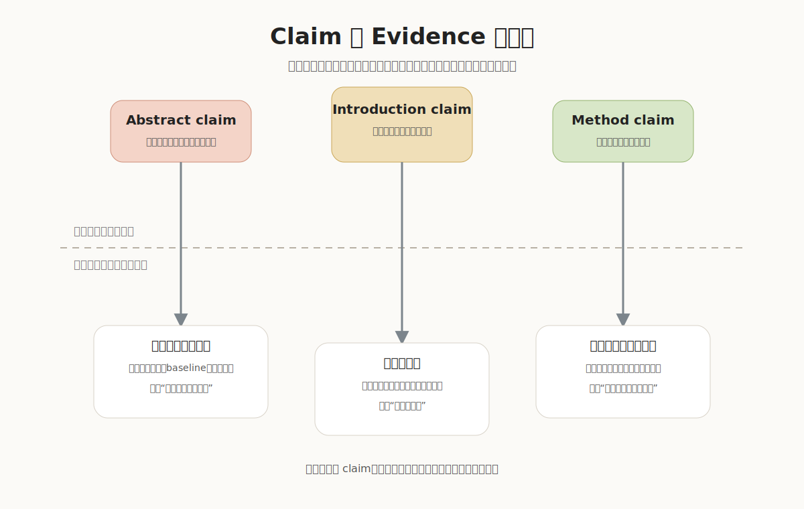

<div align="center">

# 科研论文写作与参考文献规范

### 实验室新人科研写作训练手册

把科研经验从“口口相传”沉淀为可复用、可检查、可迭代的书面规范。


</div>

---

## 目录

> [!TIP]
> 目录对齐到二级内容：先定位六个主模块，再直接跳到每个模块下最常用的小节。组内培训、开题、中期、组会、投稿前自查都可以从这里进入。

| 主模块 | 二级内容 | 跳转 |
|---|---|---|
| **0. 写作总纲** | [总原则](#01-本仓库的写作总原则) |
| **1. 手册总览** | 科研写作训练什么；核心读者；最重要的写作原则 | [进入](#1-手册总览科研写作到底在训练什么) |
| **2. 从项目到论文** | [先讲 story](#21-先讲-story再写句子) · [推荐写作顺序](#22-推荐写作顺序) · [一个月倒排计划](#23-截稿前一个月倒排计划) · [组会汇报](#24-组会时不要只报结果要报判断) | [进入](#2-从项目到论文少走弯路的完整工作流) |
| **3. 论文正文写法** | [Title 和 Abstract](#31-title-和-abstract最后写但决定第一印象) · [Introduction](#32-introduction把-reviewer-带到这篇论文必须存在的位置) · [Method](#33-method不是代码说明书而是设计论证) · [Experiments](#34-experiments用证据回答质疑) · [Related Work 和 Conclusion](#35-related-work-和-conclusion定位贡献收束边界) | [进入](#3-论文正文怎么写title-到-conclusion-的统一方法) |
| **4. 参考文献规范** | [完整字段](#41-完整参考文献应该包含什么) · [会议论文](#42-会议论文标准实例) · [期刊论文](#43-期刊论文标准实例) · [组内 GB/T 7714](#44-组内参考文献规范中文-gbt-7714-风格) · [特殊情况](#45-特殊情况怎么处理) · [BibTeX](#46-bibtex-字段建议) · [最终检查](#47-参考文献最终检查) | [进入](#4-参考文献规范字段格式实例与特殊情况) |
| **5. 知识库落地** | [页面结构](#51-推荐页面结构) · [推荐数据库](#52-推荐数据库) · [可复制模板](#53-可复制模板) · [新人训练路径](#54-新人训练路径) | [进入](#5-知识库落地方式数据库模板和检查清单) |

---


## 0. 写作总纲：这是本仓库的核心逻辑

> [!IMPORTANT]
> 本仓库是一套面向实验室训练的科研写作工作流。它的目标是：让一个项目从“有实验结果”变成“有清楚问题、有可信方法、有充分证据、有规范表达、能被后来者复用”的论文资产。(让新上手的科研人员对基本的学术规范和思想有一个学习方向的参考)

### 0.1 本仓库的写作总原则

| 原则 | 解决的问题 | 对应章节 |
|---|---|---|
| 先判断问题是否值得写 | 只因“做了实验”就开始写论文 | [1. 手册总览](#1-手册总览科研写作到底在训练什么)、[2.1 先讲 story](#21-先讲-story再写句子) |
| 先搭 story，再写正文 | 一上来写 Method 或润色英文，导致论文没有主线 | [2. 从项目到论文](#2-从项目到论文少走弯路的完整工作流) |
| 每个 claim 都要有证据 | Introduction 和 Abstract 说得很强，实验却支撑不上 | [3.4 Experiments](#34-experiments用证据回答质疑)、[5.3 Claim-Evidence Map](#53-可复制模板) |
| 图表是论证的一部分 | 图表只是装饰，不能帮助读者理解贡献 | [3.3 Method](#33-method不是代码说明书而是设计论证)、[3.4 Experiments](#34-experiments用证据回答质疑) |
| 参考文献要可追溯 | 引用格式混乱，会议、期刊、网页、预印本写法不一致 | [4. 参考文献规范](#4-参考文献规范字段格式实例与特殊情况) |
| 经验要可复用 | 组内经验只靠口头提醒，新人重复踩坑 | [5. 知识库落地](#5-知识库落地方式数据库模板和检查清单) |


## 1. 手册总览：科研写作到底在训练什么

科研写作不是把实验结果翻译成英文，也不是把所有工作细节堆进 PDF。科研写作的本质是：让读者相信你发现了一个值得解决的问题，并且你提出的方法确实带来了可靠的新知识。

| 核心问题 | 新人常见误区 | 正确写法 |
|---|---|---|
| 研究什么 | 只说技术名，不说任务和场景 | 先定义任务，再说明应用价值 |
| 为什么重要 | 用大而空的背景铺垫 | 说明旧方法在具体场景下哪里失败 |
| 你做了什么 | 按代码顺序介绍模块 | 按“问题-动机-设计-优势”介绍方法 |
| 凭什么相信 | 只放一张主结果表 | 用 comparison、ablation、analysis、failure cases 支撑 claim |

> [!IMPORTANT]
> 新人写作优先级：先让 story 成立，再让段落清楚，最后才是润色句子。不要在 story 还没讲通时过早打磨英文。

写论文时要一直记住两类读者：快速浏览的 reviewer 和认真追问的 reviewer。前者用标题、摘要、teaser、表格判断论文是否清楚可信；后者会追问每个 claim 是否有证据、方法是否必要、实验是否公平。



---

## 2. 从项目到论文：少走弯路的完整工作流

### 2.1 先讲 story，再写句子

很多新人写论文会从 Method 开始，因为 Method 看起来最像“我实际做了什么”。但真正高效的写作顺序是：先把论文 story 梳理清楚，再写各部分。

| 问题 | 你需要写出的答案 |
|---|---|
| Task 是什么 | 我们研究的问题是什么，输入输出是什么 |
| Application 是什么 | 这个问题为什么在真实应用或科学问题中重要 |
| Existing methods 怎么做 | 现有方法的主要路线是什么 |
| Gap 在哪里 | 现有方法在什么条件下不够好 |
| Insight 是什么 | 我们观察到了什么关键事实或结构 |
| Method 怎么利用 insight | 我们的方法如何把 insight 变成技术方案 |
| Contribution 是什么 | 相比已有工作，新增价值是什么 |
| Evidence 是什么 | 哪些实验或分析支撑上述贡献 |

> [!TIP]
> 判断 story 是否成熟的简单方法：不看图、不看代码，只用 3 分钟能否讲清“问题为什么重要、旧方法为什么不够、我们为什么有效”。

### 2.2 推荐写作顺序

| 顺序 | 任务 | 为什么先做 |
|---|---|---|
| 1 | 画 pipeline 草图 | 先验证方法能否被清楚解释 |
| 2 | 梳理 Introduction 思路 | 确定论文卖点和实验需求 |
| 3 | 设计 comparison 和 ablation | 避免写完才发现 claim 没证据 |
| 4 | 写 Method 初稿 | 把模块动机、设计和优势讲清 |
| 5 | 同步补实验和改 Method | 方法描述和实验结果互相校准 |
| 6 | 写 Experiments | 用证据回答 reviewer 问题 |
| 7 | 美化 teaser、pipeline、表格 | 强化第一印象和可读性 |
| 8 | 写 Related Work | 根据 story 组织相关工作 |
| 9 | 写 Abstract 和 Title | 最后浓缩整篇论文 |
| 10 | 自审和导师 review | 提前暴露拒稿风险 |

### 2.3 截稿前一个月倒排计划

| 时间 | 核心目标 | 必须产出 | 负责人应检查 |
|---|---|---|---|
| T-30 到 T-24 | story 成型 | pipeline 草图、Introduction 大纲、实验矩阵 | 3 分钟能否讲清贡献 |
| T-23 到 T-18 | 方法成型 | Method v1、核心结果表、初版消融 | 每个模块是否必要 |
| T-17 到 T-12 | 证据成型 | comparison、ablation、analysis、可视化 | claim 是否都有证据 |
| T-11 到 T-7 | 初稿完整 | Related Work、Abstract、Title、完整 PDF | 读者是否能顺着故事读 |
| T-6 到 T-3 | 反复修改 | review issue list、v2/v3/v4 | 高风险问题是否已修复 |
| T-2 到 T-0 | 投稿检查 | 匿名版、supp、代码/项目页、引用检查 | 格式、页数、引用、图表是否合规 |

### 2.4 组会时不要只报结果，要报判断

低效汇报：“我试了 A，不 work；试了 B，好一点。”

有效汇报：“我想验证 claim X，所以做了实验 A。结果说明模块 M 对数据集 D 有帮助，但在场景 S 失败。我目前判断失败原因是输入噪声破坏了假设 H，下一步要做实验 B 来确认。”

> [!IMPORTANT]
> 组会汇报不是流水账，而是训练科研判断。每一页最好回答一个问题：我为什么做这个实验、结果说明什么、下一步该怎么决策。

---

## 3. 论文正文怎么写：Title 到 Conclusion 的统一方法

> [!IMPORTANT]
> 本章保留通用写作表格：每个部分先回答“这一节要解决什么问题、逻辑是什么、读者要带走什么”。随后以 `Learning Diffusion Priors for Inverse Rendering Under Unknown Illumination` / `IntrinsicAnything` 为例，拆解具体内容。反例不是来自真实论文，而是由正例反推出的常见错误写法。

### 3.1 Title 和 Abstract：最后写，但决定第一印象

| 需要回答的问题 | 写作逻辑 | 读者应带走的信息 |
|---|---|---|
| 论文研究什么任务 | 标题和摘要第一部分明确输入、输出、任务场景 | 这不是泛泛的 3D vision，而是 unknown illumination 下的 inverse rendering/material recovery |
| 为什么这个任务难 | 摘要中指出具体困难，而不是只说 challenging | 难点来自 geometry、material、lighting 的耦合，导致反演歧义 |
| 本文核心方法是什么 | 用一句话说明方法机制，而不是列模块名 | 用 diffusion priors 学习 material distribution，并正则化优化过程 |
| 证据覆盖什么范围 | 说明数据类型、实验对象或验证方式 | real-world 和 synthetic data 上的 material recovery，而不是无边界 claim |
| 结论边界在哪里 | 避免夸大，只说实验支持的结论 | 方法提升材质恢复，但仍受几何质量等因素影响 |

| 正例聚焦点 | 论文中的具体内容 | 通俗解释 |
|---|---|---|
| 标题抓住关键条件 | `Under Unknown Illumination` | 未知光照才是这篇论文的难点和卖点 |
| 摘要先讲任务 | 从 posed images 中恢复 object materials | 先说输入输出：给多视角图像，想恢复物体材质 |
| 摘要讲清为什么难 | 几何、材质、环境光耦合 | 图像颜色可能来自材质，也可能来自光照或阴影 |
| 摘要讲方法不是堆术语 | 把 material prior 设计成 albedo 和 specular 的 diffusion models | albedo/specular 对应材质分解中的关键因素 |

| 反例写法 | 问题 | 如何改 |
|---|---|---|
| `A Novel Diffusion Framework for 3D Vision` | 太宽，任务不明确 | 写清任务和条件：`Diffusion Material Priors for Inverse Rendering under Unknown Illumination` |
| `Existing methods are inaccurate. We propose a diffusion model.` | gap 没解释，method 和 problem 没扣上 | 写清 shading/shadow 可能被误分解成 albedo，所以需要 material prior |

### 3.2 Introduction：把 reviewer 带到“这篇论文必须存在”的位置

| 需要回答的问题 | 写作逻辑 | 读者应带走的信息 |
|---|---|---|
| 任务为什么重要 | 从任务定义进入应用价值 | inverse rendering 对 VR/AR、电影、游戏等 3D 内容编辑有价值 |
| 过去怎么做 | 概括旧方法路线和依赖条件 | 受控采集、特殊硬件、co-located flashlight 等方法应用受限 |
| 现在主流怎么做 | 说明近期路线 | differentiable physically based rendering + neural scene representations 是当前主线 |
| 现有方法具体失败在哪里 | 把 gap 写成可观察的失败模式 | rendering loss 会把光照颜色、阴影、材质颜色混在一起 |
| 本文 insight 是什么 | 让方法从 gap 中自然出现 | 学习 material prior 来约束解空间 |

| 正例聚焦点 | 论文中的具体内容 | 通俗解释 |
|---|---|---|
| Fig. 1 的作用 | 展示 diffuse shading 与 albedo、shadow 与 albedo 的歧义 | 把 gap 画出来，而不是只写出来 |
| 黄色光照例子 | Xbox 被黄色光照照亮，baseline 容易把黄色光照 baked into albedo | 算法把灯光颜色当成材质颜色 |
| 自遮挡阴影例子 | 瓷玩具有自遮挡，baseline 把 shadow baked into recovered albedo | 阴影不应该变成材质纹理 |

| 反例写法 | 为什么不好 | 正确思路 |
|---|---|---|
| “Inverse rendering is important. Neural rendering is popular.” | 太泛，不能推出本文方法 | 尽快进入 unknown illumination 和 material-lighting ambiguity |
| “We use diffusion because diffusion is powerful.” | 技术追热点，动机弱 | 说明 diffusion prior 学到材质分布，能约束 ill-posed optimization |

### 3.3 Method：不是代码说明书，而是设计论证

| 需要回答的问题 | 写作逻辑 | 读者应带走的信息 |
|---|---|---|
| 方法输入输出是什么 | 先给整体 pipeline，再给局部模块 | 输入 posed images，输出 material 和 lighting |
| 每个模块为什么需要 | 每个模块前先说明它解决哪个失败模式 | diffusion prior 解决歧义，guided sampling 解决多视角不一致 |
| 方法和物理模型怎么对应 | 用 rendering equation 支撑设计 | diffuse/specular 分解对应 albedo prior 和 specular prior |
| 训练数据从哪里来 | 说明 prior 学习的数据来源 | 用 Objaverse 等 3D object data 构造训练数据 |
| 优化如何闭环 | 说明 prior 如何进入 inverse rendering | diffusion prior regularize material/light optimization |

| 正例聚焦点 | 论文中的具体内容 | 通俗解释 |
|---|---|---|
| Fig. 3 pipeline | lighting、geometry、roughness、albedo 组合渲染 RGB 和 specular images，两阶段优化 | 方法图说明从图像到材质恢复的完整路径 |
| rendering equation 分解 | 把渲染拆成 diffuse term 和 specular term | 两个 prior 来自物理分解，不是随便加模块 |
| 不直接学 roughness prior | roughness 不容易观察，很多数据集没有可靠 roughness | 好方法会解释“为什么不那么做” |
| coarse-to-fine | 第一阶段得到 coarse material，第二阶段用它 guide diffusion | 第一阶段服务第二阶段约束 |

| 不推荐写法 | 问题 | 如何改 |
|---|---|---|
| “Our method has a renderer, a diffusion model, and an optimizer.” | 像模块清单，缺少设计论证 | 按问题写：rendering loss 有歧义，所以引入 material priors |
| “We use two-stage optimization for stable training.” | stable 太虚 | 写清第一阶段产生 coarse materials，第二阶段用它们 guide diffusion |

### 3.4 Experiments：用证据回答质疑

| Reviewer 可能问什么 | 需要的证据 | 写作逻辑 |
|---|---|---|
| 方法整体有效吗 | 与强 baseline 的定量和定性比较 | synthetic data 看真值指标，real-world data 看视觉分解和 relighting |
| prior 是否真有用 | w/o prior 或替换 prior 的消融 | 证明提升来自 material prior |
| albedo/specular 是否都必要 | 分别去掉 albedo prior、specular prior | 对应方法中两个核心设计 |
| guided sampling 是否必要 | w/o guided 的结果 | 证明 diffusion prior 需要被多视角 observation 约束 |
| 方法边界是什么 | failure/limitation analysis | 告诉读者方法在哪些情况下仍然困难 |

| 正例聚焦点 | 论文中的具体内容 | 通俗解释 |
|---|---|---|
| Table I | synthetic dataset 上比较 albedo、roughness、relighting 等指标 | 主表回答“强不强” |
| Table IV | 把 diffusion prior 加到 TensoIR、NvdiffrecMC 等 baseline 上 | 说明 prior 具有一定通用性 |
| Fig. 13 | 展示 w/o spec、w/o albedo、w/o guided 的失败 | 好的消融不只有数字，还展示失败长什么样 |
| Fig. 16 | joint geometry optimization 会带来 rough surfaces | 清楚说明方法边界 |

推荐的表格解释方式：

> Table 2 verifies the role of each prior in resolving material-lighting ambiguity. Removing the albedo prior causes the recovered base color to absorb illumination effects, while removing the specular prior weakens highlight and roughness estimation. The guided training variant further improves multi-view consistency, suggesting that the diffusion prior is most effective when it is constrained by image observations rather than used as an isolated generative model.

### 3.5 Related Work 和 Conclusion：定位贡献，收束边界

| 部分 | 需要回答的问题 | 写作逻辑 |
|---|---|---|
| Related Work | 本文站在哪几条路线的交叉处 | 按技术路线组织，而不是按年份或作者罗列 |
| Related Work | 本文和每类工作有什么不同 | 先承认已有贡献，再说明本文切入点 |
| Conclusion | 本文解决了什么问题 | 回到任务和核心 gap |
| Conclusion | 本文靠什么解决问题 | 回到核心机制：albedo/specular diffusion priors、coarse-to-fine、DPS |
| Conclusion | 还有什么没解决 | 具体写边界，如 geometry quality、metallic BRDF、high-resolution consistency |

---

## 4. 参考文献规范：字段、格式、实例与特殊情况


> [!IMPORTANT]
> 本章所有示例均使用真实存在的文献。作者姓名按目标格式处理：可以缩写，作者过多时可以使用 `et al.` 或中文“等”。但文献题名、会议名称、期刊名称、出版社、论文集名称等来源信息尽量写全，不使用期刊或会议缩写。

### 4.1 完整参考文献应该包含什么

| 字段 | 含义 | 是否通常必需 | 说明 |
|---|---|---|---|
| 作者 | 谁写的 | 必需 | 按目标格式处理：列全、缩写、`et al.` 或“等” |
| 年份 | 何时发表 | 必需 | 在线优先和正式发表年份不同时，按目标格式处理 |
| 题名 | 文献标题 | 必需 | 论文题名、书名、数据集名、网页标题 |
| 来源 | 发表在哪里 | 必需 | 期刊名称、会议名称、论文集名称、书名、网站、预印本平台 |
| 卷号 volume | 期刊卷 | 期刊常见 | 会议论文通常没有卷号；不要为了整齐伪造卷号 |
| 期号 issue 或 number | 期刊期 | 期刊常见 | 有些期刊没有期号，可省略 |
| 页码 pages | 起止页 | 有则写 | 电子期刊可能使用文章编号而非页码 |
| 文章编号 article number | 替代页码 | 部分期刊常见 | 如 `aac4716`、`e105432`、Article 105432 |
| DOI | 持久标识符 | 强烈建议 | 有 DOI 时优先写 DOI |
| URL | 网页地址 | 网页、预印本、软件常见 | 无 DOI 时尤其重要 |
| 访问日期 | 何时访问网页 | 网页常见 | 稳定出版物通常不需要 |

### 4.2 会议论文标准实例

#### IEEE/ACM 数字制示例（作者较多时使用 et al.）

正文引用：

`The Transformer architecture replaces recurrence with self-attention mechanisms [1].`

参考文献：

`[1] A. Vaswani et al., "Attention Is All You Need," in Advances in Neural Information Processing Systems, 2017, pages 5998-6008.`

| 部分 | 内容 | 解释 |
|---|---|---|
| 作者 | A. Vaswani et al. | 作者较多时，IEEE/ACM 数字制中常用 `et al.` 截断 |
| 题名 | Attention Is All You Need | 论文题名完整保留 |
| 来源 | Advances in Neural Information Processing Systems | 会议论文集名称写全；组内规范中不写成 NeurIPS，也不把 “30” 当作会议名的一部分 |
| 年份 | 2017 | 正式发表年份 |
| 页码 | pages 5998-6008 | 有页码必须写 |

#### APA 7 示例（参考文献列表按 APA 规则列作者）

`Vaswani, A., Shazeer, N., Parmar, N., Uszkoreit, J., Jones, L., Gomez, A. N., Kaiser, Ł., & Polosukhin, I. (2017). Attention is all you need. In Advances in Neural Information Processing Systems (pp. 5998-6008).`

> [!NOTE]
> APA 7 的正文引用和参考文献列表规则不同。正文引用通常可写 `Vaswani et al. (2017)`；参考文献列表中，作者不超过 20 位时通常列出全部作者，超过 20 位时列前 19 位、加省略号、再列最后一位作者。

### 4.3 期刊论文标准实例

#### IEEE/数字制示例（作者很多时使用 et al.）

正文引用：

`AlphaFold demonstrates that deep learning can predict protein structures with high accuracy [2].`

参考文献：

`[2] J. Jumper et al., "Highly accurate protein structure prediction with AlphaFold," Nature, volume 596, number 7873, pages 583-589, 2021, DOI: 10.1038/s41586-021-03819-2.`

| 部分 | 内容 | 解释 |
|---|---|---|
| 作者 | J. Jumper et al. | 作者很多时使用 `et al.`，避免参考文献过长 |
| 期刊名称 | Nature | 期刊名称写全，不使用缩写 |
| 卷号 | volume 596 | 期刊卷号 |
| 期号 | number 7873 | 期刊期号；若期刊无期号则省略 |
| 页码 | pages 583-589 | 有页码必须写 |
| DOI | 10.1038/s41586-021-03819-2 | 真实 DOI，优先保留 |

#### APA 7 示例（作者较少的期刊论文）

`LeCun, Y., Bengio, Y., & Hinton, G. (2015). Deep learning. Nature, 521(7553), 436-444. https://doi.org/10.1038/nature14539`

### 4.4 组内参考文献规范（中文 GB/T 7714 风格）

> [!IMPORTANT]
> 组内开题、中期、结题、组会汇报、项目文档等场合，建议统一使用本节的 GB/T 7714 风格规范，便于中文语境下阅读和管理。正式投稿时必须以目标会议、期刊、学校或出版社要求为准，不要用组内规范替代投稿格式。

顺序编码制常见写法：

`[序号] 作者. 题名[文献类型标识]. 来源, 年, 卷(期): 起止页码.`

真实期刊示例：

`[1] JUMPER J, EVANS R, PRITZEL A, 等. Highly accurate protein structure prediction with AlphaFold[J]. Nature, 2021, 596(7873): 583-589.`

真实会议示例（组内汇报推荐写法）：

`[2] MILDENHALL B, SRINIVASAN P P, TANCIK M, 等. NeRF: Representing Scenes as Neural Radiance Fields for View Synthesis[C]//European Conference on Computer Vision. 2020: 405-421.`

| 字段 | 示例 | 说明 |
|---|---|---|
| `[2]` | 文献序号 | 正文中用 `[2]` 对应引用 |
| 作者 | `MILDENHALL B, SRINIVASAN P P, TANCIK M, 等` | 中文 GB/T 风格常用姓在前、名缩写；作者多时用“等” |
| 题名 | `NeRF: Representing Scenes as Neural Radiance Fields for View Synthesis` | 题名完整保留 |
| 类型标识 | `[C]` | conference paper，会议论文 |
| 会议名称 | `European Conference on Computer Vision` | 组内规范写会议全称，不写 ECCV 缩写 |
| 年份 | `2020` | 会议论文正式发表年份 |
| 页码 | `405-421` | 有起止页码时必须写；没有页码时写文章编号或 DOI |

### 4.5 特殊情况怎么处理

| 情况 | 处理方式 | 真实示例 |
|---|---|---|
| 会议论文没有卷号 | 不写卷号；写完整会议名称、年份、页码或论文编号 | Mildenhall 等的 NeRF 会议论文写 `European Conference on Computer Vision. 2020: 405-421`，不写 volume |
| 期刊有卷号和期号 | 写期刊名称、volume、number、pages、DOI | Jumper et al. 的 Nature 论文：volume 596, number 7873, pages 583-589 |
| 期刊有文章编号而非页码 | 用文章编号替代页码，不要伪造页码 | Open Science Collaboration, “Estimating the reproducibility of psychological science,” Science, volume 349, number 6251, article aac4716, 2015, DOI: 10.1126/science.aac4716 |
| 预印本 | 写预印本平台和编号；若已有正式发表版本，优先引用正式版本 | Pumarola et al., “D-NeRF: Neural Radiance Fields for Dynamic Scenes,” arXiv preprint arXiv:2011.13961, 2020 |
| 数据集论文 | 按会议或期刊论文引用，不能只写数据集网址 | Lin et al., “Microsoft COCO: Common Objects in Context,” in European Conference on Computer Vision, 2014, pages 740-755 |
| 软件论文 | 如果软件有论文，优先引用论文；必要时同时给版本和网址 | Harris et al., “Array programming with NumPy,” Nature, volume 585, number 7825, pages 357-362, 2020, DOI: 10.1038/s41586-020-2649-2 |
| 网页 | 写机构或作者、网页标题、网站名、URL、访问日期 | American Psychological Association, “References,” APA Style, https://apastyle.apa.org/style-grammar-guidelines/references, accessed 2026-06-07 |
| 标准 | 写发布机构、标准号、标准名、年份 | National Information Standards Organization, ANSI/NISO Z39.29-2005, Bibliographic References, 2005 |

### 4.6 BibTeX 字段建议

> [!IMPORTANT]
> BibTeX / Zotero / EndNote 中建议尽量保存完整作者数据；真正显示在论文里的作者截断规则，应交给期刊、会议、`.bst` 文件或 CSL 样式处理。不要为了显示 `et al.` 就随意删除数据库中的作者字段。

会议论文真实示例：

```bibtex
@inproceedings{mildenhall2020nerf,
  author    = {Mildenhall, Ben and Srinivasan, Pratul P. and Tancik, Matthew and Barron, Jonathan T. and Ramamoorthi, Ravi and Ng, Ren},
  title     = {NeRF: Representing Scenes as Neural Radiance Fields for View Synthesis},
  booktitle = {European Conference on Computer Vision},
  year      = {2020},
  pages     = {405--421},
  doi       = {10.1007/978-3-030-58452-8_24}
}
```

文章编号真实示例：

```bibtex
@article{openScienceCollaboration2015estimating,
  author  = {{Open Science Collaboration}},
  title   = {Estimating the reproducibility of psychological science},
  journal = {Science},
  year    = {2015},
  volume  = {349},
  number  = {6251},
  pages   = {aac4716},
  doi     = {10.1126/science.aac4716}
}
```

### 4.7 参考文献最终检查

- 正文引用和参考文献列表是否一一对应。
- 是否引用了数据集、baseline、评价指标、工具库和理论来源。
- 是否优先引用正式发表版本，而不是只引用预印本。
- 作者名是否按目标格式处理；来源信息是否写全。
- DOI、URL、页码、文章编号、卷期号是否放在正确字段。
- 组内开题、中期、组会文档是否使用统一 GB/T 7714 风格；正式投稿是否切换为目标要求。

---

## 5. 知识库落地方式：数据库、模板和检查清单

建议把这个手册作为实验室“科研训练”或“论文写作规范”的首页。页面不要拆得太碎，采用一个主页面加几个数据库即可。

### 5.1 推荐页面结构

| 模块 | 内容 |
|---|---|
| 顶部说明 | 手册目的、适用对象、核心原则 |
| 目录 | 6 个大章节，支持点击跳转 |
| 图示区 | 写作飞轮、claim-evidence 图、参考文献结构图 |
| 正文区 | 本手册主体 |
| 模板区 | Paper Card、Story Outline、Claim-Evidence Map |
| 数据库区 | 项目、文献、实验、review issue |

### 5.2 推荐数据库

| 数据库 | 字段 |
|---|---|
| Paper Projects | 项目名、负责人、阶段、目标会议、deadline、当前版本、风险等级 |
| Literature Bank | 标题、作者、年份、类型、方向、BibTeX、精读状态、与项目关系 |
| Experiment Log | 日期、实验目的、配置、结果、结论、失败原因、下一步 |
| Claim-Evidence Map | claim、出现位置、证据、状态、负责人、处理方式 |
| Review Issues | 问题、来源、严重程度、对应章节、解决状态、修改记录 |

### 5.3 可复制模板

| 模板 | 用途 |
|---|---|
| Paper Card | 记录论文问题、方法、实验、局限和可借鉴写法 |
| Story Outline | 记录 Task、Application、Gap、Insight、Method、Contribution、Evidence |
| Claim-Evidence Map | 检查每个 claim 是否有实验、引用、理论或分析支撑 |
| Reviewer 自审清单 | 投稿前从 contribution、writing、experiments、method、references、presentation 六个维度自查 |

### 5.4 新人训练路径

| 周次 | 训练目标 | 交付物 |
|---|---|---|
| Week 1 | 学会读论文 | 3 篇 Paper Card |
| Week 2 | 学会看方法 | 1 张 pipeline 重画图 |
| Week 3 | 学会组织 story | 1 份 Introduction reverse outline |
| Week 4 | 学会做证据表 | 1 份 Claim-Evidence Map |
| Week 5 | 学会自审 | 1 份 reviewer-style review |
| Week 6 | 学会写 mini paper | 4 页项目短论文 |

---

## 来源与参考

- 彭思达老师 Learning Research 仓库：<https://github.com/pengsida/learning_research>
- 论文写作参考资料：<https://pengsida.notion.site/c1a22465a0fa4b15a12985223916048e>
- Research Paper Writing Skills 结构化仓库：<https://github.com/Master-cai/Research-Paper-Writing-Skills>
- APA Style 官方参考文献指南：<https://apastyle.apa.org/style-grammar-guidelines/references>
- IntrinsicAnything / Learning Diffusion Priors for Inverse Rendering Under Unknown Illumination：<https://arxiv.org/abs/2404.11593>
- Learning Diffusion Priors for Inverse Rendering Under Unknown Illumination, IEEE Transactions on Pattern Analysis and Machine Intelligence：<https://doi.org/10.1109/TPAMI.2026.3650770>
- Attention Is All You Need 论文页：<https://proceedings.neurips.cc/paper/7181-attention-is-all-you-need>
- NeRF 论文记录：<https://par.nsf.gov/biblio/10301170-nerf-representing-scenes-neural-radiance-fields-view-synthesis>
- AlphaFold 期刊论文：<https://www.nature.com/articles/s41586-021-03819-2>
